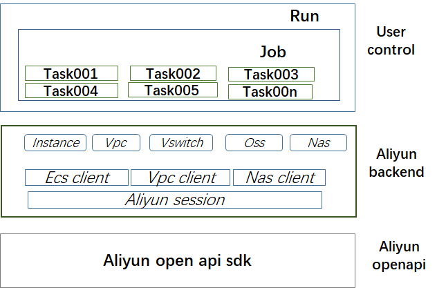
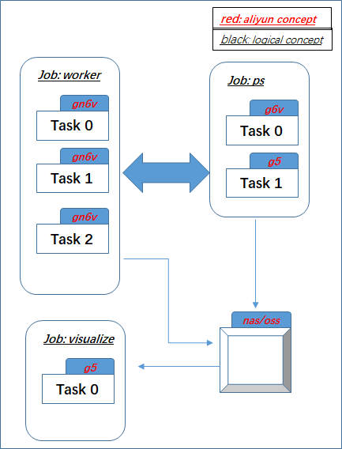
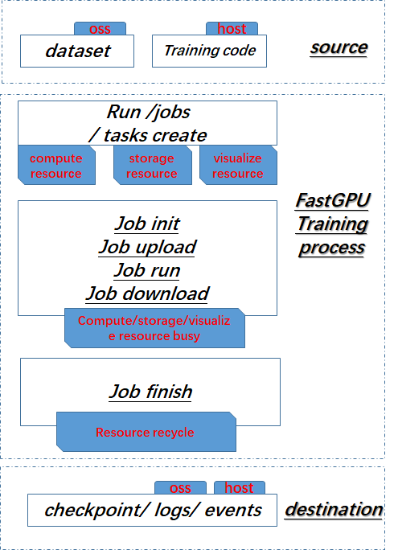
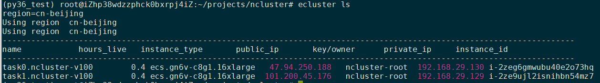
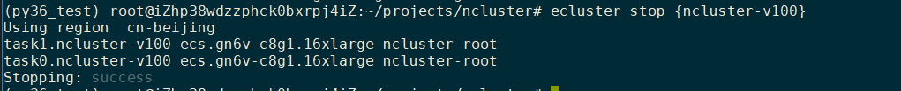
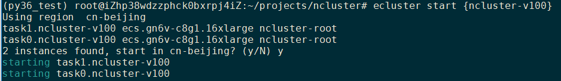
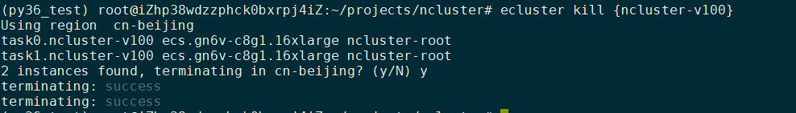
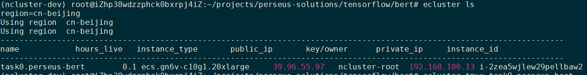

# FastGPU v1.0.3 使用文档

# 一，FastGPU简介

FastGPU是一套构建在阿里云上的人工智能计算极速部署工具，其提供便捷的接口和自动化工具实现人工智能训练/推理计算在阿里云IAAS资源上的快速部署。
FastGPU提供两套组件：

- ncluster 运行时组件提供便捷的api将线下的人工智能训练/推理脚本快速的部署在阿里云IAAS资源上进行计算。
- ecluster命令行组件提供便捷的命令行工具用于管理阿里云上人工智能计算的运行状态和集群的生命周期。

FastGPU的作为衔接用户线下人工智能算法和线上海量阿里云GPU计算资源的关键一环，方便用户将人工智能算法计算一键构建在阿里云的IAAS资源上，无需关心IAAS层相关的计算、存储、网络等繁琐的部署操作，做到简单适配、一键部署，随处运行的效果。为用户提供了省时、经济、便捷的基于阿里云IAAS资源的人工智能即刻构建方案。



图一展示了FastGPU的组成模块，底层调用阿里云的OpenAPI实现阿里云云上资源的交互层；中间层对人工智能运行所需的计算/网络/存储所需的对象封装形成阿里云的后端层；上层将人工智能的作业/任务和相应的阿里云实例资源进行映射适配形成用户控制层，即用户API接口。用户只需使用上层接口即可以方便的构建阿里云上的IAAS级人工智能计算。




图二展示了FastGPU 作业/任务与阿里云上实例资源的映射关系，每一个task映射一台阿里云实例资源，用户可自行根据人工智能算法的需求将一或若干个task组成一组Job用于分布式训练/可视化显示等，FastGPU提供便捷的接口完成该映射关系。




图三展示使用FastGPU进行人工智能训练的典型范例，用户的起点（source）为数据和训练代码，FastGPU组件将帮助用户自动完成中间训练过程的计算/存储/可视化资源的生命周期，用户最终获取训练完成后的模型/日志等(destination)


# 二，FastGPU使用说明
## 2.1. FastGPU安裝方法
FastGPU安装方式

  - python环境 python3.x， 推荐使用Anaconda 和 python 3.6
  - 软件包下载地址：

     [https://ali-perseus-release.oss-cn-huhehaote.aliyuncs.com/ncluster-1.0.3-py3-none-any.whl](https://ali-perseus-release.oss-cn-huhehaote.aliyuncs.com/ncluster-1.0.1-py3-none-any.whl)

  - 安装命令   
```bash
pip install https://ali-perseus-release.oss-cn-huhehaote.aliyuncs.com/ncluster-1.0.3-py3-none-any.whl
```

## 2.2. FastGPU运行时使用说明

本节介绍ncluster常用的api用于将线下的人工智能训练/推理脚本快速部署到阿里云上进行计算

- 1. export阿里云账号信息和需要使用的Region
```bash
export ALIYUN_ACCESS_KEY_ID=xxxxxxx      # Your actual aliyun access key id
export ALIYUN_ACCESS_KEY_SECRET=xxxxxx   # Your actual aliyun access key secret
export ALIYUN_DEFAULT_REGION=cn-beijing  # The actual region the resource you want to use
```

- 2. ncluster是一套python库，使用时需要在python脚本里import
```python
import ncluster
```

- 3. 使用ncluster.make_job api 创建人工智能任务对用的阿里云上的计算资源/或复用已经存在的计算资源
```python
  job = ncluster.make_job(name=args.name,
                          run_name=f"{args.name}-{args.machines}",
                          num_tasks=args.machines,
                          image_name=IMAGE_NAME,
                          instance_type=INSTANCE_TYPE)
```
    其中，
```bash
    -name 为该组任务的名称，如 bert
    -run_name 为运行时的环境名，一般设置为 任务名+机器数
    -num_tasks 为需要申请的阿里云实例个数。如，num_tasks=4将在阿里云云上创建4台相同的实例，分别对用               job.tasks[0], job.tasks[1], job.tasks[2], job.tasks[3]。创建处理的实例的名称分别为task0.{name}, task1.                 {name}, task2.{name}及task3.{name} (详见第三节)
    -imange_name 为阿里云云上实例所需的镜像名称, 可以使用公共镜像或自定义镜像
    -instance_type 为需要申请的实例的类型, 如ecs.gn6v-c10g1.20xlarge 为阿里云8卡V100机型的实例类型
```

- 4. 使用job/task的api使用阿里云实例运行任务, 如下
```python
# 对job里的每个实例执相同的命令
job.run('cd perseus-bert') 

# 对job里的task0 执行命令
job.tasks[0].run('cd perseus-bert') 

# 将当前目录的perseus-bert 文件/文件夹上传到job每台实例的/root/目录下
job.upload('perseus-bert')

# 将当前目录的perseus-bert 文件/文件夹上传到task0每台实例的/root/目录下
job.tasks[0].upload('perseus-bert')
```


 [注]: job 和task拥有相同的调用api, job的api将作用于所有tasks, task的api只作用于具体的某一个task

**_第三节的示范脚本展示用使用ncluster runtime 进行bert finetune训练_**


## 2.3. FastGPU命令行使用说明

FastGPU提供便捷的命令行工具ecluster用于管理云上资源的生命周期和查看运行过程的日志和日常开发等

- 1. export 阿里云账号信息和需要使用的Region
```bash
export ALIYUN_ACCESS_KEY_ID=xxxxxxx      # Your actual aliyun access key id
export ALIYUN_ACCESS_KEY_SECRET=xxxxxx   # Your actual aliyun access key secret
export ALIYUN_DEFAULT_REGION=cn-beijing  # The actual region the resource you want to use
```

- 2. 使用 ecluster ls 命令 展示现有的机器，如下


     其中，

```bash
     -name 展示了实例的名称
     -hours_live 展示实例创建至今的时间，以小时为单位
     -instance_type 展示实例类型
     -public_ip 展示实例的公网
     -key/owner 展示密钥/账号名
     -private_ip  展示实例的内网
     -instance_id  展示实例的id
```

- 3. 使用ecluster create 创建一组实例，可以使用ecluster create -c create.cfg，其中create.cfg为该组实例的配置环境，如下
     
```bash
; config.ini

[ncluster]
; The job name for current creation job.
name=ncluster-v100
; The number of machine you want to create
machines=1
; The system disk size for instances in GB
system_disk_size=300
; The data disk size for instances in GB
data_disk_size=0
; The system image name you want to installed in the instances.
image_name=ubuntu_18_04_64_20G_alibase_20190624.vhd
; The instance type you want to create at Alibaba Cloud.
instance_type=ecs.gn6v-c8g1.16xlarge
; The spot instance option; If you want to buy spot instance, please set it to True.
spot=False
; If only used to create instances, it can set to True.
confirm_cost=False
; Confirm the next operation will cost money, if set to True will default confirmed.
skip_setup=True
; Nas create/mount options; Set True will disable nas mount for current job.
disable_nas=True
; The zone id info. The option provided to use resource in the zone.
zone_id=cn-beijing-h
; Specify the vpc name
vpc_name=ncluster-vpc

[cmd]
install_script=pwd
```
 
    实例创建完成后可通过ecluster ls 命令查看创建的情况，该命令创建好的实例如步骤2所示

- 4. 登陆实例 可通过 ecluster ssh $taskname。

      如步骤3 创建的实例第一个的命令是 ecluster ssh task0.ncluster-v100

- 5. 停止一个/一组实例用 ecluster stop

         如，步骤2展示的实例，停止task0 用 ecluster stop task0.ncluster-v100
                                  停止 整组实例群用  ecluster stop {ncluster-v100}
         实际命令效果如下，


- 6. 启动已经停止的一台/一组的实例用 ecluster start

          如，步骤2展示的实例，启动task0 用 ecluster stop task0.ncluster-v100
                                   启动整组实例群用  ecluster stop {ncluster-v100}
       实际命令效果如下，


- 7. 释放一台/一组实例用 ecluster kill

          如，步骤2展示的实例，启动task0 用 ecluster kill task0.ncluster-v100
                                   启动整组实例群用  ecluster kill {ncluster-v100}
       实际命令效果如下，



下面的列表展示ecluster支持的所用命令行

```bash
ecluster [help,-h,--help]  # show the usage of ecluster command 
ecluster {command} --help  # show the usage of specific command
ecluster ls    # list instances of current user.
ecluster ssh {task name}   #login to specified instance
ecluster stop {task name}  # stop specified instance
ecluster start {task name} # start specified instance
ecluster kill {task name}  # kill specified instance
ecluster tmux {task name}  # ssh and tmux attach to running task. If there is no tmux session, will fall back to ssh.
ecluster mount {task name}  # mount nas to /ncluster for specified instance.
ecluster scp {source} {destination} # scp file/folder from souce to destination.
ecluster create --config create.cfg  # create instance by a config file.
ecluster create --name ncluster1 --machines 1 ... # create instance by parameters
ecluster addip {task name}     # add the public ip of current machine  to security group for the specific task.
ecluster rename {old_name} {new_name} # rename name of specified instance
```


# 三, FastGPU示范用例

以下以BERT finetune为例，展示FastGPU的使用，该用例部署时间 3.5 min, 训练时长11.5 min，总共耗时15 min，训练精度达到0.88+

- 1 . 使用ncluster api编写训练脚本train_news_classifier.py， 如下，
```python
#!/usr/bin/env python

import argparse
import ncluster
import os
import time

INSTANCE_TYPE = 'ecs.gn6v-c10g1.20xlarge' # V100
NUM_GPUS = 8

ncluster.set_backend('aliyun')
parser = argparse.ArgumentParser()
parser.add_argument('--name', type=str, default='perseus-bert',
                    help="name of the current run, used for machine naming and tensorboard visualization")
parser.add_argument('--machines', type=int, default=1,
                    help="how many machines to use")
args = parser.parse_args()

def main():
  start_time = time.time()
  # 1. Create infrastructure
  supported_regions = ['cn-huhehaote', 'cn-zhangjiakou', 'cn-shanghai', 'cn-hangzhou', 'cn-beijing']
  assert ncluster.get_region() in supported_regions, f"required AMI {IMAGE_NAME} has only been made available in regions {supported_regions}, but your current region is {ncluster.get_region()} (set $ALYUN_DEFAULT_REGION)"
  
  job = ncluster.make_job(name=args.name,
                          run_name=f"{args.name}-{args.machines}",
                          num_tasks=args.machines,
                          instance_type=INSTANCE_TYPE)
  # 2. Upload perseus bert code.
  job.run('apt install unzip')
  job.upload('perseus-bert')
  job.run('conda activate tensorflow_1.14.0_cu10.0_py36')

  # 3. Download pretrain model and dataset.
  BERT_CHINESE_BASE_DIR = '/root/chinese_L-12_H-768_A-12'
  DATA_DIR = '/root/toutiao_data'
  job.run('wget -c -t 10 https://public-ai-datasets.oss-cn-huhehaote.aliyuncs.com/chinese_L-12_H-768_A-12.zip  && unzip chinese_L-12_H-768_A-12.zip')
  job.run('wget -c -t 10 https://public-ai-datasets.oss-cn-huhehaote.aliyuncs.com/toutiao_data.tgz && tar xvf toutiao_data.tgz')

  # 4. Run the training job.
  job.run('cd perseus-bert')
  hosts = [task.ip + f':{NUM_GPUS}' for task in job.tasks]
  host_str = ','.join(hosts)

  mpi_cmd = ['mpirun --allow-run-as-root',
            f'-np {args.machines * NUM_GPUS}',
            f'--npernode {NUM_GPUS}',
            f'--host {host_str}',
            '--bind-to none',
            '-x NCCL_DEBUG=INFO',
            '-x PATH',
            '-x PYTHONPATH', 
            '-x LD_LIBRARY_PATH',
            '-x XLA_FLAGS']

  bert_classifier_cmd = ['python run_classifier.py', 
                         '--task_name=news',
                         '--do_train=true',
                         '--do_eval=true',
                         f'--data_dir={DATA_DIR}',
                         f'--vocab_file={BERT_CHINESE_BASE_DIR}/vocab.txt',
                         f'--bert_config_file={BERT_CHINESE_BASE_DIR}/bert_config.json',
                         f'--init_checkpoint={BERT_CHINESE_BASE_DIR}/bert_model.ckpt',
                         '--max_seq_length=128',
                         '--train_batch_size=48',
                         '--learning_rate=8e-5',
                         '--num_train_epochs=3.0',
                         '--warmup_proportion=0.8',
                         '--output_dir=/root/output_dir',
                         '--use_amp=true',
                         '--use_perseus=true',
                         '--use_xla=true']
  
  cmd = mpi_cmd + bert_classifier_cmd
  cmd = " ".join(cmd)
  job.tasks[0].run(f'echo {cmd} > {job.logdir}/task-cmd')
  job.tasks[0].run(cmd, non_blocking=True)
  print(f"Logging to {job.logdir}")

  eclapse_time = time.time() - start_time
  print(f'training deploy time is: {eclapse_time} s.')


if __name__ == '__main__':
  main()
```

- 2. 运行训练任务
```bash
python train_news_classifier.py
```
     当脚本运行成功显示如下，
```bash
Logging to /ncluster/runs/perseus-bert-1
training deploy time is: 196.9283847808838 s.
```

- 3. 使用 `ecluster ls`  显示任务绑定的阿里云GPU实例




- 4. 使用 `ecluster tmux task0.perseus-bert`.登陆实例显示训练过程日志，最终结果如下


