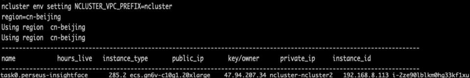
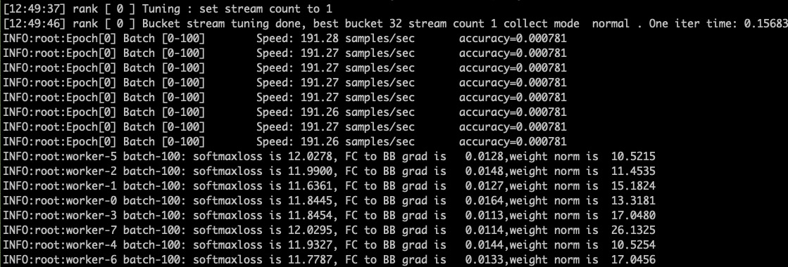

# Face Recognition using insightface .

## prerequisite
* Aliyun account
* ncluster package installed.

## Training
* 1.Register your aliyun acount using below command.
```Bash
export ALIYUN_ACCESS_KEY_ID=xxxxx
export ALIYUN_ACCESS_KEY_SECRET=xxxxx
export ALIYUN_DEFAULT_REGION=cn-beijing
```

* 2.Run the training job with
```Bash
python train_insightface.py
```
After the training job deployed to cloud, the console display as followed.
```Bash
Logging to /ncluster/runs/perseus-insightface-1
training deploy time is: xxxs.
```

* 3.Use `ecluster ls` to display the cloud machine.


* 4.Attach to running console using `ecluster tmux task0.perseus-insightface`. 


## Time
The deploy time is about 5 min, the training time is about 2600sec per epoch, The total one epoch time is about 45 min.

## Accuracy
On Instance of 8x V100, resnet101, each gpu batchsize 32, embedding 512, class_num 85164
Under the fix learning rate, the statistical results display as followed:
- After one epoch, the accuracy is 0.90.
- After three epoch, the accuracy is up to 0.97.

## Speedup
On Instance of 8x V100 (gn6v-c10g1.20xlarge) the speedup result 
Condition: resnet101, each gpu batchsize 32, embedding 512, class_num 200w

| machine-gpu | each gpu training speed | gpu memory | speed up |
| ----------- | ----------------------- | ---------- | -------- |
| 1-8         | 150samples/s            | 12429M     | 1        |
| 2-16        | 140samples/s            | 10309M     | 0.93     |


