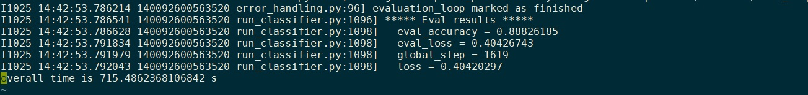

# News classifier example using BERT funtune.

## Prerequisite

* Aliyun account
* fastgpu package installed.

## Training

1. Register your aliyun acount using below command.

```Bash
export ALIYUN_ACCESS_KEY_ID=xxxxx
export ALIYUN_ACCESS_KEY_SECRET=xxxxx
export ALIYUN_DEFAULT_REGION=cn-beijing
```

2. Run the training job with

```Bash
python train_news_classifier.py
```

After the training job deployed to cloud, the console display as followed.

```Bash
training deploy time is: 196.9283847808838 s.
```

3. Use `fastgpu ls` to display the cloud machine.
```
In Region cn-beijing
Running Instances:
------------------------------------------------------------------------------------------------
Instance Name    | Age(hr) | Public IP       | Private IP      | GPU      | Instance Type
------------------------------------------------------------------------------------------------
task0.aiacc-bert |   125.4 | 112.125.xxx.xxx | 192.168.xxx.xxx | V100 x 8 | ecs.gn6v-c8g1.16xlarge
------------------------------------------------------------------------------------------------
task1.aiacc-bert |   125.4 | 112.125.xxx.xxx | 192.168.xxx.xxx | V100 x 8 | ecs.gn6v-c8g1.16xlarge
------------------------------------------------------------------------------------------------
```
1. Attach to running console using `fastgpu tmux task0.aiacc-bert`. The runing log will display in it. The result is.
   

## Acccuracy.

The final accuracy is 0.888 and we provide the accuracy of 8 card without accuracy loss compared to 1 card training.

## Time

The deploy time is about 3.5 min, the training time is about 11.5 min, The total time is about 15 min.

## Benchmark

On Instance of 8x V100 (gn6v-c10g1.20xlarge) the benchmark result in examples/sec.

| method   | 1 GPU | 8 GPU  | speed up |
| -------- | ----- | ------ | -------- |
| base     | 118.5 | 865.6  | 7.3      |
| amp+xla  | 400   | 2720.8 | 6.8      |
| speed up | 3.37  | 3.14   |          |
