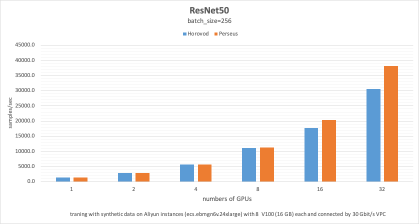
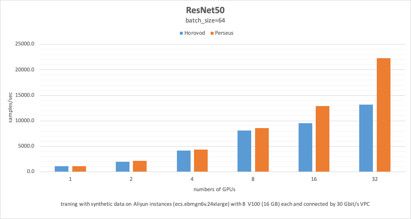
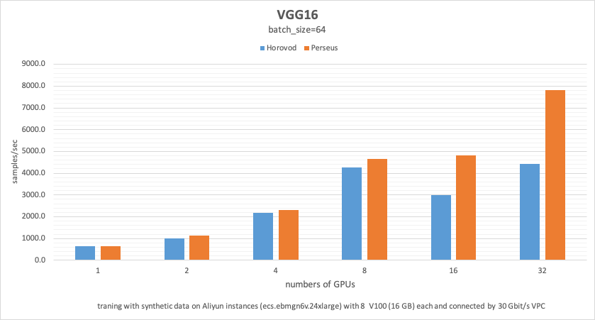

# Overview
The goal of the project is to benchmark the performance of different models. 
## FastGPU

FastGPU is a set of fast one-click deployment tools for artificial intelligence computing built on Alibaba Cloud.  
  [Usage of FastGPU](doc/fastgpu.md)  
  [Cloud Shell](https://shell.aliyun.com/?__source=sls.console.aliyun.com#/)  

## AIACC-Training
The AI training acceleration tool AIACC-Training (formerly Ali-Perseus-Training) is a unified distributed deep learning training acceleration engine launched by Alibaba Cloud. It supports four mainstream distributed training frameworks, namely Tensorflow, Pytorch, MXNet and Caffe.

# Quick Start 

### FastGPU Setup
1. Install ncluster:

        $ pip3 install https://ali-perseus-release.oss-cn-huhehaote.aliyuncs.com/fastgpu/ncluster-1.0.8-py3-none-any.whl
2. Register your aliyun acount:
        
        export ALIYUN_ACCESS_KEY_ID=xxxxx       # Your actual aliyun access key id
        export ALIYUN_ACCESS_KEY_SECRET=xxxxx   # Your actual aliyun access key secret
        export ALIYUN_DEFAULT_REGION=xxxxx      # The actual region of resource you want to use, e.g. 'cn-zhangjiakou'
    
### Tensorflow Benchmark 
1. Clone the repository:
        
        git clone https://github.com/aliyun/alibabacloud-aiacc-demo.git
        cd perseus-io-benchmarks

2. Run the script to start a quick training:

        python fastgpu_script.py --name=tfbenchmark --model=resnet50 --batch_size=64 --machines=1 --gpus=8
        
    the default instance type is [ecs.ebmgn6v.24xlarge](<https://help.aliyun.com/document_detail/60576.html#section-lke-80h-kzu>) with 8 x NVIDIA V100 (16 GB), make sure you have the access and enough quota for this type of instance.

3. When you see `Logging to /ncluster/runs/tfbenchmark-4`, the script is running. You can check the list of running instance by using:
        
        ecluster ls

4. Attach to the running console by using:
    
        ecluster tmux task0.tfbenchmark
    
    or 
    
        ecluster ssh task0.tfbenchmark
    
    After you login the task0 machine, you can
    - monitor the running status:  `watch -n 0.5 nvidia-smi`
    - view the output and results: `vim \ncluster\machine_x_x.log`  

5. If it's done, you can release the resource by using:

        ecluster kill <instance_name>
        
    or
        
        ecluster kill {<job_name>}
    

    
        
    

# Performance 

#### ResNet50 with batch_size=256
Our results were obtained by running the training script `rn50_bs256_command.sh` in the tensorflow_1.15_cu10.0_py36 env on ecs.ebmgn6v.24xlarge instance with 8x V100 (16GB) GPUs.

| **num_of_node** | **num_of_gpu** | **perseus_1.3.2rc3**  | **<-并行效率** | **<-多机加速比** | **horovod_0.19.2** | **<-并行效率** | **<-多机加速比** | **perseues vs horovod** |
|:---:|:---:|:---:|:---:|:---:|:---:|:---:|:---:|:---:|
| 1	| 1	| 1437.2 | 1.00 |  | 1424.4 | 1.00 |  | 1.01 |
| 1	| 2	| 2832.6 | 0.99 |  | 2836.8 | 1.00 |  | 1.08 |
| 1	| 4	| 5696.8 | 0.99 |  | 5674.4 | 1.00 |  | 1.00 |
| 1	| 8	| 11328.8 |	0.99 |  | 11140.8 |	0.98 |  | 1.02 |
| 2	| 8	| 20316.8 |	0.88 | 0.90 | 17654.4 | 0.77 | 0.79 | 1.15 |
| 4	| 8	| 38160.6 |	0.83 | 0.83 | 30579.2 | 0.67 | 0.69 | 1.25 |

#### Other benchmarks

These results were obtained by running the training script `rn50_bs64_command.sh`. 

| **num_of_node** | **num_of_gpu** | **perseus_1.3.2rc3**  | **<-并行效率** | **<-多机加速比** | **horovod_0.19.2** | **<-并行效率** | **<-多机加速比** | **perseues vs horovod** |
|:---:|:---:|:---:|:---:|:---:|:---:|:---:|:---:|:---:|
| 1	| 1	| 1153.5 | 1.00 |  | 1081.9 | 1.00 |  | 1.07 |
| 1	| 2	| 2175.8 | 0.94 |  | 2009.2 | 0.93 |  | 1.08 |
| 1	| 4	| 4386.4 | 0.95 |  | 4143.2 | 0.96 |  | 1.06 |
| 1	| 8	| 8612.8 |	0.93 |  | 8092.0 |	0.93 |  | 1.06 |
| 2	| 8	| 12907.2 |	0.70 | 0.75 | 9571.2 | 0.55 | 0.59 | 1.35 |
| 4	| 8	| 22320.0 |	0.60 | 0.65 | 13228.8 | 0.38 | 0.41 | 1.69 |
\
\
These results were obtained by running the training script `vgg16_bs64_command.sh`. 

| **num_of_node** | **num_of_gpu** | **perseus_1.3.2rc3**  | **<-并行效率** | **<-多机加速比** | **horovod_0.19.2** | **<-并行效率** | **<-多机加速比** | **perseues vs horovod** |
|:---:|:---:|:---:|:---:|:---:|:---:|:---:|:---:|:---:|
| 1	| 1	| 652.0 | 1.00 |  | 636.7 | 1.00 |  | 1.07 |
| 1	| 2	| 1131.8 | 0.87 |  | 1019.8 | 0.80 |  | 1.11 |
| 1	| 4	| 2318.4 | 0.89 |  | 2163.2 | 0.85 |  | 1.07 |
| 1	| 8	| 4646.4 |	0.89 |  | 4268.8 |	0.84 |  | 1.09 |
| 2	| 8	| 4825.6 |	0.46 | 0.52 | 2996.8 | 0.29 | 0.35 | 1.61 |
| 4	| 8	| 7820.8 |	0.37 | 0.42 | 4416.0 | 0.22 | 0.26 | 1.77 |

# Advanced

`fastgpu_script.py` command-line options:

    usage: fastgpu_script.py [-h] [--name NAME] [--machines MACHINES] [--instance_type INSTANCE_TYPE] [--gpus GPUS] [--env ENV]
                             [--py2] [--hvd] [--data_dir DATA_DIR] [--use_ramdisk USE_RAMDISK] [--image_size IMAGE_SIZE]
                             [--batch_size BATCH_SIZE] [--model MODEL] [--disable_xla]
    
    optional arguments:
      -h, --help            show this help message and exit
      --name NAME           name of the current run, used for machine naming and tensorboard visualization
      --machines MACHINES   how many machines to use
      --instance_type INSTANCE_TYPE
                            choose the type of instance, make sure you have access and enough quota for this type.
      --gpus GPUS           how many gpu you want to use in one machine.
      --env ENV             version of tensorflow. 1.12, 1.14, 1.15 or 2.1.
      --py2                 flag to use python2
      --hvd                 flag to use horovod as variable_update instead of perseus.
      --data_dir DATA_DIR
      --image_size IMAGE_SIZE
                            image size for training model
      --batch_size BATCH_SIZE
                            batch size per device
      --model MODEL         model to train
      --disable_xla         disable XLA auto-jit compilation

Default setting is using the synthetic data benchmark, for more details, please check: https://github.com/tensorflow/benchmarks 

# Related

https://github.com/aliyun/alibabacloud-aiacc-demo/blob/master/tensorflow/bert/train_news_classifier.py